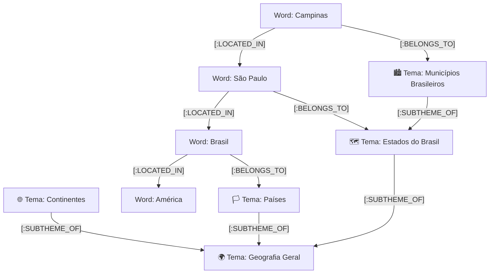

# 🎮 Jogo da Forca - SysOps Edition

> Uma evolução moderna do clássico jogo de forca em terminal: de um script monolítico em **Bash** para uma aplicação **TUI orientada a objetos com Python, Textual, Neo4j Graph Database e Delivery Multi-Container**.

---

## 📑 Sumário

- [Visão Geral](#-visão-geral)
- [Evolução: Do Bash (.sh) ao Grafo Neo4j e Multi-Container](#-evolução-do-bash-sh-ao-grafo-neo4j-e-multi-container)
- [Novas Funcionalidades e Telas](#-novas-funcionalidades-e-telas)
- [Arquitetura de Repositórios e Domínio](#-arquitetura-de-repositórios-e-domínio)
- [Grafo Geográfico no Neo4j (Taxonomia & Conexões)](#-grafo-geográfico-no-neo4j-taxonomia--conexões)
- [Delivery e Execução em Containers](#-delivery-e-execução-em-containers)
- [Sistema de Pontuação e Ranking](#-sistema-de-pontuação-e-ranking)
- [Controles e Navegação por Teclado](#-controles-e-navegação-por-teclado)
- [Histórico do Projeto Original (Bash)](#-histórico-do-projeto-original-bash)

---

## 🎯 Visão Geral

O **Jogo da Forca - SysOps Edition** é um jogo de terminal interativo com estética *SysOps / Dark Terminal*, desenvolvido com foco em alta responsividade, navegação 100% via teclado físico (sem necessidade de mouse), código modularizado (SOLID / Clean Architecture) e suporte a múltiplos backends de armazenamento (**Neo4j Graph Database**, **SQL Relacional** e **Arquivos Locais**).

---

## 🚀 Evolução: Do Bash (`.sh`) ao Grafo Neo4j e Multi-Container

| Característica | Versão Original (`forca.sh`) | Versão Atual (Textual + Neo4j + Docker) |
| :--- | :--- | :--- |
| **Linguagem / Stack** | Bash CLI (`echo`, `sed`, `tr`, `read`) | Python 3 + Textual Framework |
| **Arquitetura** | Monolítico procedural em arquivo único | Arquitetura POO modular com **Interfaces Desacopladas** (`IWordRepository`, `IPlayerRepository`, `WordRepositoryFactory`) |
| **Banco de Vocabulário** | Leitura direta de `.txt` em disco | **Neo4j Graph Database** com taxonomia hierárquica e relações semânticas (`LOCATED_IN`, `BELONGS_TO`) |
| **Persistência de Usuários** | Sem persistência | **Banco SQL Relacional** (`users`, `player_stats`, `partidas`) |
| **Layout Responsivo** | Rígido (tamanho fixo de linhas de terminal) | **Detecção de Aspect Ratio**: alterna dinamicamente entre **Horizontal** e **Vertical** respeitando a regra de **40/60** |
| **Navegação** | Apenas digitação sequencial no `read` | **100% Teclado Físico**: Setas, atalhos de acorde (`Ctrl+F`, `Ctrl+R`, `Ctrl+M`, `Ctrl+Esc`) e slot de letra dedicado `Letra: _` |
| **Delivery / Execução** | Script bash local | **Multi-Container Docker**: `./setup.sh` (com flags `--grafo` / `--arquivo`) e `./run.sh` |

---

## 🖥️ Telas e Recursos da Aplicação

1. **🏠 Menu Principal (`MenuScreen`):** Logo em arte ASCII estilizada e botões diretos: `Iniciar Jogo [Enter]`, `Ranking [R]` e `Sair [Ctrl+Esc]`.
2. **👤 Seleção de Jogador (`SelectPlayerScreen`):** Identificação por apelido/tag com histórico e seleção rápida via `OptionList`.
3. **🎮 Tela de Jogo (`GameScreen`):**
   - **Grid Adaptativo 40/60:** A View da Forca (desenho ASCII dos 6 estágios + vidas) e o Painel de Interação se reorganizam dinamicamente em linha ou coluna.
   - **Slot de Letra Centralizado:** Exibe `Letra: _` inline, atualizando em tempo real com digitação direta e sem colisão de foco com botões.
   - **Ações Inferiores Proporcionais:** 3 botões em texto limpo dividindo igualmente o rodapé (`Chutar [Ctrl+F]`, `Refresh [Ctrl+R]`, `Menu [Ctrl+M]`).
4. **🏆 Ranking Geral (`RankingScreen`):** Tabela interativa (`DataTable`) com pódio visual (🥇 1º, 🥈 2º, 🥉 3º), pontuação acumulada, vitórias, partidas, taxa de vitória e maior sequência (*Best Streak*).
5. **🪟 Modais Contextuais:** Modal de chute de palavra completa (`ChuteModal`) e tela de vitória/derrota com revanche rápida (`GameOverModal`).

---

## 🏗️ Arquitetura Multi-Banco e Domínio

O motor do jogo ([`ForcaEngine`](file:///home/ryse/Documentos/forca_zipada/core/engine.py)) é **100% agnóstico e desacoplado**, utilizando uma **Persistência Poliglota (Multi-Model)** especializada:

* **🐬 MySQL 8.0:** Autenticação de jogadores, credenciais e estatísticas consolidadas de ranking (`users`, `player_stats`).
* **🍃 MongoDB 6.0:** Dicionário principal de vocabulário (`dicionario`) e auditoria detalhada de sessões em JSON (`logs_partidas`).
* **🌐 Neo4j 5.26:** Grafo de conhecimento para rotas geográficas e geração de dicas progressivas automáticas.

```text
forca_zipada/
├── core/
│   ├── engine.py                  # Motor central de regras da forca
│   ├── models.py                  # Dataclasses de domínio (WordData, Categoria, Player, GameState)
│   ├── normalizer.py              # Normalizador Unicode NFKD
│   ├── orientation.py             # Detector de aspect ratio para layouts dinâmicos
│   ├── database.py                # DatabaseManager (Pool MySQL + Cliente MongoDB)
│   ├── dictionary_seed.py         # Seed determinístico com SHA-256 para MongoDB
│   ├── auth_service.py            # Serviço de Autenticação (MySQL)
│   ├── ranking_service.py         # RankingService (MySQL + MongoDB, implementa IPlayerRepository)
│   ├── mongo_word_repository.py   # MongoWordRepository (Implementa IWordRepository via MongoDB)
│   ├── neo4j_word_repository.py   # Neo4jWordRepository (Implementa IWordRepository)
│   ├── neo4j_hint_repository.py   # Neo4jHintRepository (Implementa IHintRepository via Cypher)
│   ├── file_word_repository.py    # FileWordRepository (Implementa IWordRepository fallback)
│   └── word_repository_factory.py # Fábrica de instanciação por ambiente (WORD_BACKEND)
├── interfaces/
│   ├── word_repository.py         # Interface IWordRepository (Vocabulário e Temas)
│   ├── hint_repository.py         # Interface IHintRepository (Dicas Contextuais)
│   ├── player_repository.py       # Interface IPlayerRepository (Usuários e Ranking)
│   ├── base_screen.py             # BaseGameScreen (Textual Screen com ciclo de vida)
│   ├── base_modal.py              # BaseGameModal (ModalScreen)
│   └── controller.py              # Interface IController
├── screens/                       # Telas e Stylesheets isolados (TCSS)
│   ├── menu/                      # Menu Principal (screen.py, menu.tcss)
│   ├── player_select/             # Seleção de Jogador (screen.py, player_select.tcss)
│   ├── game/                      # Partida com widget de dicas (screen.py, game.tcss)
│   ├── ranking/                   # Leaderboard (screen.py, ranking.tcss)
│   └── modals/                    # Modais (chute, game_over)
├── styles/
│   └── global.tcss                # Design system global e paleta de cores
├── scripts/
│   └── populate_graph_geography.py # Ingestão e estruturação do Grafo no Neo4j
├── seed_dicionario.py             # Script de carga de palavras no MongoDB
├── init.sql                       # Esquema DDL inicial do MySQL
├── listas/                        # Dicionários de palavras por categoria
├── Dockerfile                     # Imagem Docker multi-backend otimizada
├── docker-compose.yml             # Orquestrador multi-container (MySQL, Mongo, Neo4j, App)
├── setup.sh                       # Provisionamento automático e carga de bancos
├── run.sh                         # Launcher de execução interativa (Docker ou Local)
└── forca_app.py                   # Ponto de entrada Textual (Orquestrador)
```

---

## 🌐 Grafo de Conhecimento e Dicas no Neo4j

O Neo4j atua como um **Knowledge Graph de Dicas Progressivas**. Durante a partida, a cada letra enviada pelo jogador, o motor do jogo consulta o grafo em tempo real e revela uma nova dica contextual através da travessia de relacionamentos:



### 💡 Mecânica de Dicas Automáticas
A cada letra digitada, o jogo avança dinamicamente o nível de profundidade no grafo:
1. **Dica 1 (Início):** Classificação taxonômica (*"🏛️ Tipo: Município Brasileiro"*).
2. **Dica 2 (1ª Letra):** Relacionamento de 1º salto (*"📍 Situado em São Paulo"*).
3. **Dica 3 (2ª Letra):** Relacionamento de 2º salto (*"🌎 Continente: América"*).
4. **Dica 4 (3ª Letra):** Morfologia e extensão da palavra (*"📏 Palavra possui 8 letras"*).
5. **Dica 5 (4ª Letra):** Pista fonética/letra inicial (*"🔤 Primeira letra é 'C'"*).

---

## 🐳 Delivery e Execução em Containers

A aplicação roda em containers Docker interativos com suporte a cores 24-bit (TrueColor) e TTY:

### 1. Provisionamento e Grafo de Dicas (`./setup.sh`)
```bash
# Constrói o container da aplicação e popula o Knowledge Graph no Neo4j:
./setup.sh
```

### 2. Iniciar o Jogo (`./run.sh`)
```bash
# Executa via Docker Container:
./run.sh

# Ou executa em modo Python Local (sem Docker):
./run.sh --local
```

---

## 📊 Sistema de Pontuação e Ranking

A pontuação de cada partida é calculada dinamicamente:
* **Vitória:**
  $$\text{Pontos} = 100 \text{ (base)} + (20 \times \text{tentativas restantes}) + \min(\text{streak} \times 10, 100)$$
* **Derrota:**
  $$\text{Pontos} = 10 \text{ (participação)}, \quad \text{streak} = 0$$

---

## ⌨️ Controles e Navegação por Teclado

| Ação | Teclas |
| :--- | :--- |
| **Digitar Letra** | Qualquer tecla `A-Z` ou `Ç` |
| **Limpar Letra** | `Backspace` / `Delete` |
| **Enviar Letra** | `Enter` (com o slot de letra focado) |
| **Navegar Foco** | `↑` / `↓` / `←` / `→` |
| **Chutar Palavra Toda** | `Ctrl + F` |
| **Nova Palavra / Refresh** | `Ctrl + R` |
| **Menu Principal** | `Ctrl + M` |
| **Voltar (em telas/modais)** | `Esc` |
| **Sair da Aplicação** | `Ctrl + Esc` ou `Ctrl + Q` |

---

## 📜 Histórico do Projeto Original (Bash)

<details>
<summary><b>Clique para expandir as notas do projeto acadêmico original (Sistemas Operacionais II - 2026)</b></summary>

### Descrição Original
O projeto inicial foi o desenvolvimento de um jogo CLI de forca em Bash, visando prática e aprofundamento no uso de Shell Script e terminal Linux.

**Comandos e utilitários principais utilizados no script original:**
* `$echo` e sequências ANSI de escape para formatação no terminal
* `$RANDOM` para sorteio de palavras e índices
* Laço `while` para o loop principal da sessão
* `shopt -s globstar` para indexação recursiva de arquivos de palavras em `listas/`
* `sed` e `tr` para tratamento de strings e remoção de acentuação

</details>

---

Desenvolvido por **Ryan Henrique Bezerra da Silva (Ryse)**.